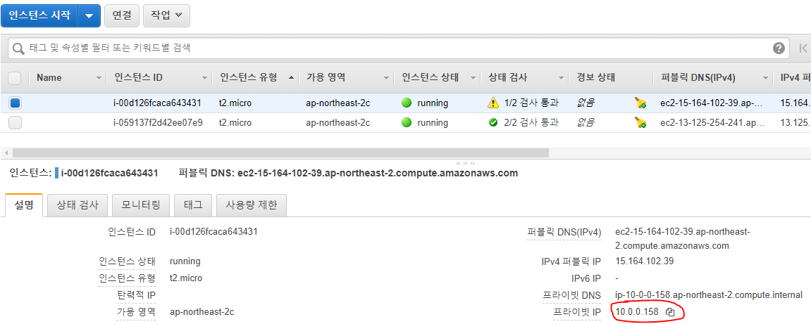
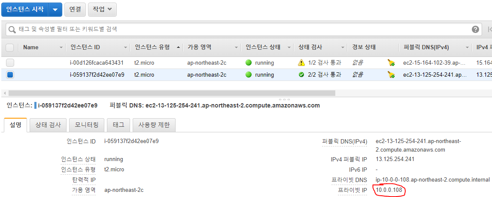
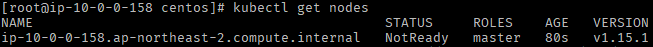
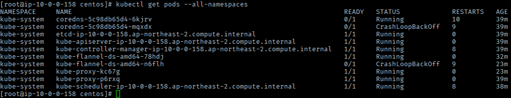
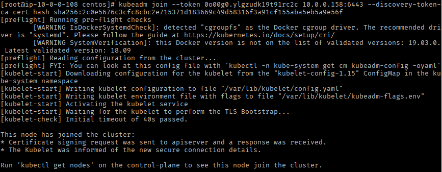
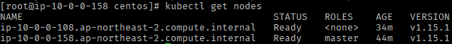

# Install k8s on CentOS

## 0. 준비

### 용어 설명

- `k8s`: 쿠버네티스
- `노드`: 컴퓨터 1대 (각 서버)

### 클라우드를 통한 노드 생성

환경 구성은 AWS의 EC2 인스턴스를 2개 생성하여 진행함  
(AWS와 같은 클라우드나 PC 2대 사용해도 됨)

아래는 정보는 인스턴스 생성 직후 확인한 정보

- Master 노드



- Worker 노드



- 정리

| HOSTNAME | Private IP | EC2 Instance type | OS |
|---|:---:|:---:|:---:|
| k8s-master | 10.0.0.158 | t2.micro | CentOS 7 |
| k8s-worker | 10.0.0.108 | t2.micro | CentOS 7 |

- 프리티어에서 사용할 수 있는 인스턴스 유형 중 `t2.micro` 선택
- OS는 2개의 인스턴스 모두 `CentOS 7` 선택
- vCPU: 1, RAM: 1G 사양
- HOSTNAME은 각 인스턴스간 접근할 호스트명임 (그냥 IP로 접근해도 되지만, 쉽게 파악하기 위함)
- 생성한 EC2 인스턴스에 SSH로 붙어서 작업함

### 주의사항

- 모든 작업은 `su` 권한으로 진행
- 인스턴스간 네트워크 통신을 위해 VPC 설정을 했으나 AWS가 아닌 다른 클라우드인 경우 해당 클라우드에서 제공하는 방식으로 네트워크 환경을 구성해야함

## 1. SELinux 정책 비활성화

SELinux 정책으로 인해 오류가 발생할 수 있으므로 비활성화 처리 진행

```bash
setenforce 0
sed -i -e "s/^SELINUX=enforcing$/SELINUX=disabled/g" /etc/selinux/config
```

## 2. 네트워크 방화벽 설정

- Master & Worker 공통 실행 (firewalld 설치 및 활성화)

```bash
yum install firewalld
systemctl enable firewalld
systemctl start firewalld
```

- Master Node에서 아래 명령어 실행
  - `10.0.0.108` 부분은 각 실습, 운영 환경에 맞게 Worker 노드의 IP 작성하기

```bash
firewall-cmd --new-zone k8s --permanent
firewall-cmd --zone=k8s --set-target=ACCEPT --permanent
firewall-cmd --add-source=10.0.0.108 --zone=k8s --permanent
firewall-cmd --reload
```

- Worker Node에서 아래 명령어 실행
  - `10.0.0.158` 부분은 각 실습, 운영 환경에 맞게 Master 노드의 IP 작성하기

```bash
firewall-cmd --new-zone k8s --permanent
firewall-cmd --zone=k8s --set-target=ACCEPT --permanent
firewall-cmd --add-source=10.0.0.158 --zone=k8s --permanent
firewall-cmd --reload
```

## 3. 호스트 파일 수정

- Master & Worker 노드 모두 진행

```bash
vi /etc/hosts

10.0.0.158 k8s-master
10.0.0.105 k8s-worker
```

## 4. Swap 설정 비활성화

kubeadm 실행 전 비활성화 해야함
- Master & Worker 노드 모두 진행

```bash
swapoff -a
```

## 5. 도커 설치

- Master & Worker 노드 모두 진행

```bash
# Docker 실행을 위한 패키지 설치 및 도커 레포지토리 등록
yum install yum-utils device-mapper-persistent-data lvm2
yum-config-manager --add-repo https://download.docker.com/linux/centos/docker-ce.repo

# Docker 설치
yum install docker-ce

# 서비스 활성화 및 실행
systemctl enable docker
systemctl start docker

# 도커 버전 확인 (설치 확인)
docker --version
```

## 6. k8s 설치

- Master & Worker 노드 모두 진행

```bash
echo 1 > /proc/sys/net/bridge/bridge-nf-call-ip6tables
sysctl -w net.bridge.bridge-nf-call-ip6tables=1
echo 1 > /proc/sys/net/bridge/bridge-nf-call-iptables
sysctl -w net.bridge.bridge-nf-call-iptables=1
```

쿠버네티스 레포지토리 등록

```bash
cat << EOF > /etc/yum.repos.d/kubernetes.repo
[kubernetes]
name=Kubernetes
baseurl=https://packages.cloud.google.com/yum/repos/kubernetes-el7-x86_64
enabled=1
gpgcheck=1
repo_gpgcheck=1
gpgkey=https://packages.cloud.google.com/yum/doc/yum-key.gpg https://packages.cloud.google.com/yum/doc/rpm-package-key.gpg
exclude=kube*
EOF
```

설치

```bash
yum install kubeadm --disableexcludes=kubernetes
```

서비스 활성화

```bash
systemctl enable kubelet
systemctl start kubelet
```

## 7. k8s 마스터노드 실행

- Master 노드에서만 실행

```bash
kubeadm init --apiserver-advertise-address 10.0.0.158 --pod-network-cidr 10.0.0.0/24 --ignore-preflight-errors=NumCPU

# kubeadm init --apiserver-advertise-address 마스터노드IP --pod-network-cidr IP대역/서브넷마스크
```

> --ignore-preflight-errors=NumCPU 옵션은 EC2 인스턴스의 사양이 낮아서 오류가 발생했기 때문에 강제로 오류를 무시하기 위해 추가한 플래그

> k8s 권장 사양이 2 vCPU인데 현재 환경은 1 vCPU 이기 때문에 오류가 발생함

```bash
kubeadm join 10.0.0.158:6443 --token 0o00g0.ylgzudk19t91rc2c \
    --discovery-token-ca-cert-hash sha256:2c0e5676c3cfc8cbc2e715371d183669c49d58316f3a91cf155aba5eb5a9e56f
```

- 잠시 뒤 위와 같은 메시지가 출력되며 IP, PORT, 토큰값, 해시값을 따로 기록해두기!

아래 명령어를 입력하여 쿠버네티스 노드 정보를 확인할 수 있다

```bash
kubectl get nodes
```



## 8. CNI 설정 (k8s 클러스터 네트워크 설정)

많은 CNI 구성 방법이 있으나 여기에선 `Flannel` 사용

- Master 노드에서만 실행!

```bash
kubectl apply -f https://raw.githubusercontent.com/coreos/flannel/bc79dd1505b0c8681ece4de4c0d86c5cd2643275/Documentation/kube-flannel.yml

kubectl get pods --all-namespaces
```



Flannel 환경이 구성된것을 확인할 수 있다.

## 9. Worker 노드 생성

- Worker 노드에서만 실행!
- Worker 노드 생성
- `7번` 과정에서 기록해두었던 서버 IP, 포트, 토큰, 해시값이 필요함!

```bash
kubeadm join --token 0o00g0.ylgzudk19t91rc2c 10.0.0.158:6443 --discovery-token-ca-cert-hash sha256:2c0e5676c3cfc8cbc2e715371d183669c49d58316f3a91cf155aba5eb5a9e56f
```



Worker 노드 생성된 모습, Master 노드에서 `kubectl get nodes` 명령어를 입력하면 새로운 Worker 노드가 추가된것을 확인할 수 있다.



## 10. 마무리

k8s 클러스터 구성이 마무리 되었습니다.  
